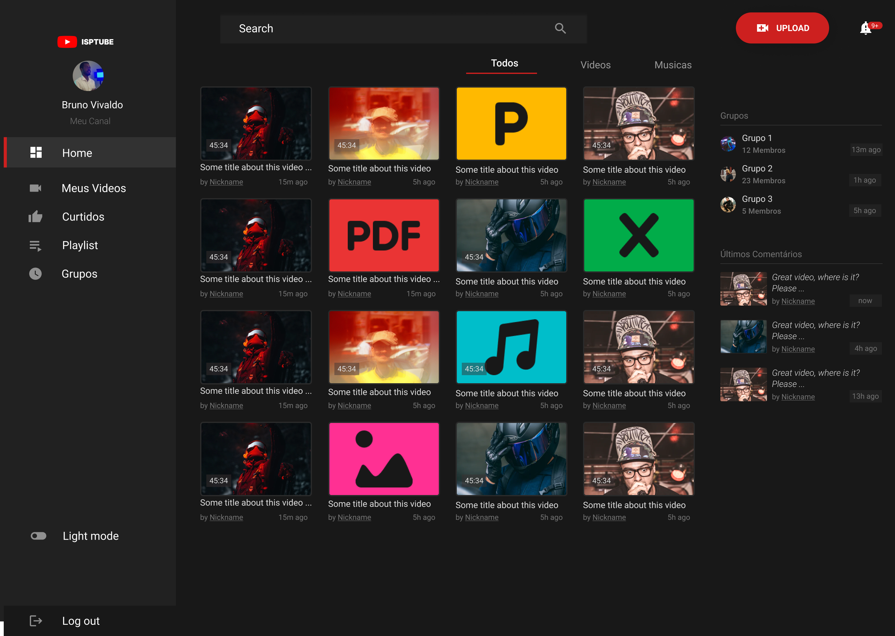

# ISPTUBE
> Plataforma digital de gestão e compartilhamento de conteúdos multimídia, com funcionalidades semelhantes às plataformas como Youtube e Spotify.

Essa plataforma oferece aos usuários a possibilidade de acessar e reproduzir arquivos de vídeo, música e outros tipos de mídia online. Além disso, a plataforma também permite que os usuários compartilhem e carreguem seus próprios arquivos multimídia.

Portanto, esse projeto visa fornecer uma solução conveniente e eficiente para a gestão e compartilhamento de conteúdos multimídia, utilizando a tecnologia de streaming para facilitar o acesso e a reprodução de arquivos sem a necessidade de baixá-los.





## Exemplo de uso

Entre na pasta backend e instale as dependências 

```sh
cd backend
npm install
```
Faça o mesmo com as pastas frontend ou desktop 

Depois de instaladas configure os serviços de banco de dados de sua preferência e o redis para gestão das filas. 


## Features

- Using new Next.js 13 Beta
- New `/app` dir,
- Routing, Layouts, Nested Layouts and Layout Groups
- Data Fetching, Caching and Mutation
- Uses client and server components from **React 18**
- API Routes
- Queue system with bullmq
- ORM using **Prisma**
- PostgreSQL Database
- Redis cache Database
- Written in **TypeScript**


## Contributing

1. Faça o _fork_ do projeto 
2. Crie uma _branch_ para sua modificação (`git checkout -b feature/fooBar`)
3. Faça o _commit_ (`git commit -am 'Add some fooBar'`)
4. _Push_ (`git push origin feature/fooBar`)
5. Crie um novo _Pull Request_


